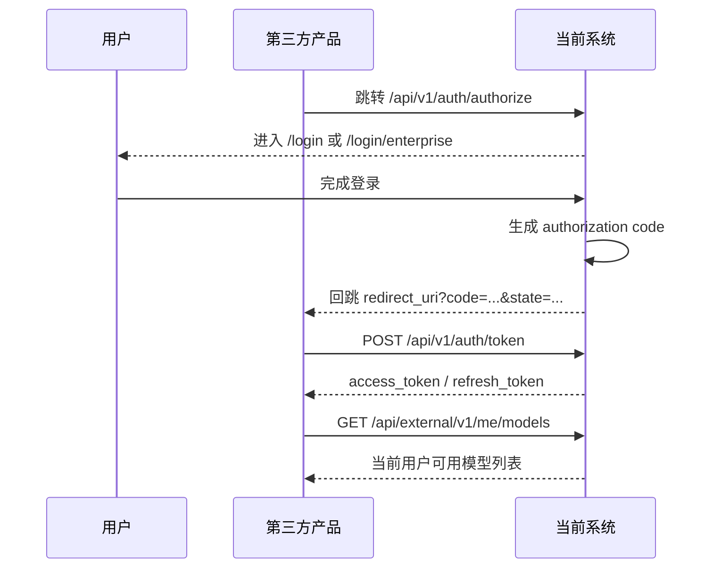

# 第三方产品接入登录与获取模型流程

本文档用于说明第三方新产品如何接入当前系统，完成：

- 登录当前系统用户
- 获取当前用户可用模型列表
- 在 token 过期后刷新 token

本文档基于当前仓库实现整理，适用于 Web、H5、桌面端或其他 SaaS 产品。

## 1. 总体方案

当前系统对第三方产品开放的是标准 OAuth 授权码模式，推荐接入链路如下：

1. 管理员先在管理后台创建第三方 OAuth 客户端
2. 第三方前端把用户跳转到本系统授权地址
3. 用户在本系统完成登录
4. 本系统生成 `authorization code` 并回跳第三方回调地址
5. 第三方服务端使用 `code + client_secret` 换取 `access_token`
6. 第三方使用 `access_token` 调用 `/api/external/v1/me/models`

可用时序如下：



## 2. 对接前置准备

第三方产品正式接入前，先由你们系统管理员完成以下配置：

### 2.1 创建 OAuth 客户端

管理入口：

- `/dashboard/oauth-clients`

需要配置：

- `name`：客户端名称
- `client_id`：第三方产品唯一标识
- `allowedRedirectUris`：允许的回调地址列表
- `isActive`：是否启用
- `defaultOrganizationId`：可选，第三方客户端默认绑定组织

注意事项：

- `client_id` 创建后不建议改动
- `client_secret` 创建后只展示一次，第三方服务端必须妥善保存
- `redirect_uri` 必须和后台配置完全匹配，否则会被拒绝
- 如果设置了 `defaultOrganizationId`，普通用户首次登录或后续登录时，会自动归属到该组织

### 2.2 推荐 scope

如果第三方只需要“登录后获取模型列表”，建议最小申请：

```text
models:read
```

如果还要展示用户配额，可一起申请：

```text
models:read quota:read
```

如果是桌面端还要走 Claw 会话接口，则通常申请：

```text
models:read quota:read claw:sessions:write
```

## 3. 登录并获取 Token 流程

## 3.1 第三方发起授权

第三方前端将用户重定向到：

```http
GET /api/v1/auth/authorize
```

示例：

```text
GET /api/v1/auth/authorize
  ?client_id=acme-chat-web
  &redirect_uri=https://app.example.com/oauth/callback
  &state=RANDOM_STATE
  &scope=models:read quota:read
```

参数说明：

- `client_id`：后台已创建的客户端 ID
- `redirect_uri`：第三方回调地址，必须命中白名单
- `state`：第三方生成的随机串，用于防 CSRF
- `scope`：本次申请的权限范围

系统行为：

1. 校验 `client_id` 是否存在且启用
2. 校验 `redirect_uri` 是否在允许列表中
3. 校验通过后，302 跳转到本系统登录页

## 3.2 用户在本系统登录

当前系统有两种登录入口：

- `/login`：普通用户登录，使用手机号 + 短信验证码
- `/login/enterprise`：企业用户登录，使用邮箱 + 密码

当前实现里，`/api/v1/auth/authorize` 默认会把用户带到 `/login`。

因此第三方接入时要注意：

- 普通用户可直接继续在 `/login` 完成登录
- 如果用户是企业账号，需要使用 `/login/enterprise`，并保留原始 OAuth 查询参数

普通用户登录的当前行为：

- 首次使用手机号，在验证码校验通过后会自动创建普通用户
- 如果 OAuth 客户端配置了 `defaultOrganizationId`，用户会自动绑定到该组织

## 3.3 系统生成授权码并回跳

用户登录成功后，登录页前端会自动调用：

```http
POST /api/v1/auth/authorize/consent
```

请求体示例：

```json
{
  "client_id": "acme-chat-web",
  "redirect_uri": "https://app.example.com/oauth/callback",
  "scope": "models:read quota:read"
}
```

系统会生成授权码，并回跳到第三方：

```text
https://app.example.com/oauth/callback?code=AUTH_CODE&state=RANDOM_STATE
```

说明：

- `code` 有效期当前为 10 分钟
- `code` 只能使用一次

## 3.4 第三方服务端换取 Token

第三方服务端调用：

```http
POST /api/v1/auth/token
Content-Type: application/json
```

请求体示例：

```json
{
  "grant_type": "authorization_code",
  "code": "AUTH_CODE",
  "client_id": "acme-chat-web",
  "client_secret": "YOUR_CLIENT_SECRET",
  "redirect_uri": "https://app.example.com/oauth/callback"
}
```

成功响应示例：

```json
{
  "access_token": "ACCESS_TOKEN",
  "refresh_token": "REFRESH_TOKEN",
  "token_type": "Bearer",
  "expires_in": 3600
}
```

说明：

- `access_token` 当前有效期为 1 小时
- `refresh_token` 当前有效期为 7 天
- `redirect_uri` 必须与授权阶段一致
- `client_secret` 只应保存在第三方服务端，不应下发到前端

## 4. 获取当前用户可用模型

拿到 `access_token` 后，第三方调用：

```http
GET /api/external/v1/me/models
Authorization: Bearer ACCESS_TOKEN
```

当前接口要求：

- 必须携带 Bearer Token
- Token 必须包含 `models:read`

成功响应示例：

```json
{
  "code": "OK",
  "message": "",
  "data": {
    "defaultModel": "claude-sonnet-4",
    "defaultModelProvider": "anthropic",
    "providers": [
      {
        "provider": "anthropic",
        "enabled": true,
        "apiKey": "enc:v1:IV_BASE64:AUTH_TAG_BASE64:CIPHERTEXT_BASE64",
        "baseUrl": "",
        "apiFormat": "openai",
        "codingPlanEnabled": false,
        "models": [
          {
            "id": "claude-sonnet-4",
            "model": "claude-sonnet-4",
            "name": "Claude Sonnet 4",
            "displayName": "Claude Sonnet 4",
            "supportsImage": false,
            "enabled": true,
            "usageMeta": {
              "billingTier": "tier_2",
              "billingTierName": "高级模型",
              "creditPerMinute": 2,
              "maxSessionSeconds": 1800,
              "toolPolicy": "full",
              "estimatedRemainingMinutes": 340,
              "isUnlimited": false
            }
          }
        ]
      }
    ],
    "updatedAt": "2026-03-25T10:50:27.872Z"
  }
}
```

第三方通常重点关注这些字段：

- `defaultModel`
- `defaultModelProvider`
- `providers[].provider`
- `providers[].enabled`
- `providers[].models[].model`
- `providers[].models[].enabled`
- `providers[].models[].usageMeta`

模型可见范围的当前规则：

- `company`：公共模型，用户可见
- `department`：用户所属组织范围内模型可见
- `personal`：仅模型 owner 本人可见

也就是说，第三方不需要自己计算权限，直接以接口返回结果为准。

## 5. Token 刷新流程

当 `access_token` 过期后，第三方服务端调用：

```http
POST /api/v1/auth/refresh
Content-Type: application/json
```

请求体：

```json
{
  "refresh_token": "REFRESH_TOKEN"
}
```

成功响应：

```json
{
  "access_token": "NEW_ACCESS_TOKEN",
  "refresh_token": "NEW_REFRESH_TOKEN",
  "token_type": "Bearer",
  "expires_in": 3600
}
```

建议：

- 第三方服务端负责刷新 token
- 前端不要直接保存 `client_secret`
- 刷新后要同时更新新的 `refresh_token`

## 6. 异常处理建议

常见错误场景如下：

### 6.1 授权阶段

- `AUTH_INVALID_CLIENT`：`client_id` 不存在或未启用
- `AUTH_INVALID_REDIRECT`：`redirect_uri` 不在白名单内
- `VALIDATION_MISSING_PARAMS`：缺少必填参数

### 6.2 Token 阶段

- `AUTH_INVALID_CODE`：授权码无效或已过期
- `AUTH_INVALID_CLIENT`：`client_secret` 错误
- `AUTH_INVALID_REDIRECT`：回调地址不一致
- `VALIDATION_UNSUPPORTED_GRANT`：`grant_type` 不支持

### 6.3 获取模型阶段

外部接口统一返回结构：

```json
{
  "code": "FORBIDDEN_RESOURCE_SCOPE_REQUIRED",
  "normalizedCode": "UNAUTHORIZED",
  "error": "Missing required scopes: models:read",
  "message": "Missing required scopes: models:read",
  "data": {}
}
```

重点处理：

- `AUTH_MISSING_TOKEN` / `UNAUTHORIZED`：未带 token
- `AUTH_INVALID_TOKEN` / `AUTH_INVALID`：token 无效
- `AUTH_USER_INACTIVE`：用户被禁用
- `FORBIDDEN_RESOURCE_SCOPE_REQUIRED`：缺少 `models:read`

## 7. 关于 `apiKey` 字段

`/api/external/v1/me/models` 返回的 `providers[].apiKey` 当前是兼容字段：

- 如果服务端存的是明文，会直接返回明文
- 如果服务端存的是加密值，会返回 `enc:v1:...` 格式密文

如果第三方只是“拿模型列表做选择”，可以忽略这个字段。

如果第三方还要直接使用该模型供应商的 API Key 调模型，需要按项目当前约定解密。解密规则见：

- `MODEL_API_KEY_DECRYPTION.md`

不建议把解密后的 API Key 输出到日志。

## 8. 第三方接入最小闭环

如果只是做最小可用接入，建议按下面顺序联调：

1. 管理后台创建 OAuth 客户端，拿到 `client_id` 和 `client_secret`
2. 第三方前端接入 `/api/v1/auth/authorize`
3. 第三方回调页接收 `code`
4. 第三方服务端调用 `/api/v1/auth/token`
5. 第三方服务端调用 `/api/external/v1/me/models`
6. 前端展示可用模型列表和默认模型

## 9. 当前实现里的几个落地注意点

- OAuth 授权入口当前默认跳到 `/login`，这是普通用户短信登录页
- 企业账号场景需要使用 `/login/enterprise`，并保留 OAuth 查询参数
- `client_secret` 只能放服务端
- 第三方应始终校验 `state`
- 第三方应把获取模型的逻辑放在服务端或受控 BFF 层，避免直接暴露更多鉴权细节

